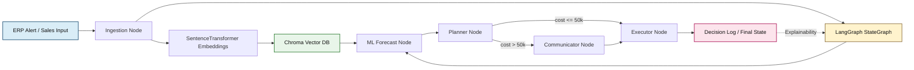
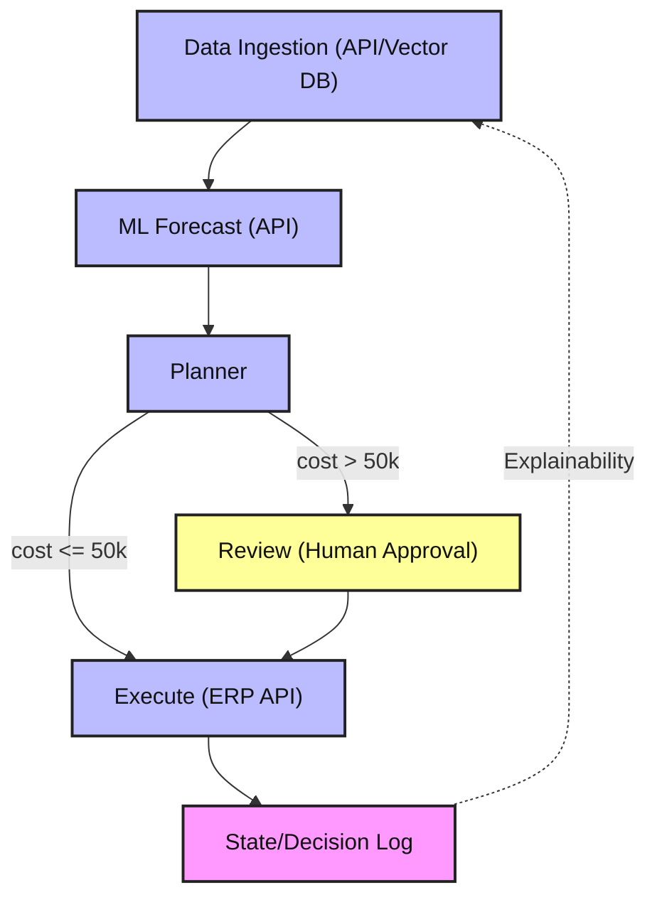

# Supply Chain Reorder Agent

An agentic AI system to help supply chain planners decide how much inventory to reorder. Built with LangGraph for workflow orchestration, modular nodes, and explainable state management.

## Features
- LangGraph workflow for modular, extensible agent logic
- Nodes for data ingestion (API/vector DB), ML forecasting (API), optimization, human review, and execution
- State management for explainability and traceability
- Ready for integration with ERP APIs, ML models, and data sources
- Configurable business rules
- Unit tests and production-ready structure

## Workflow Overview

The agent is orchestrated by LangGraph. The logical flow is:

1. **Data Ingestion**: Parses disruption input and stores embedded chunks in Chroma
2. **ML Forecasting**: Retrieves vector context and optionally forecasts demand from `sales_history`
3. **Planner**: Chooses a mitigation path and records disruption cost
4. **Review**: Flags expensive disruptions for human approval
5. **Execution**: Finalizes mitigation execution and logs the outcome

All calculations and decisions are logged for explainability. You can extend any node to connect to real APIs, databases, or ML endpoints as needed.

## Setup
1. Clone the repo
2. Install dependencies: `pip install -r requirements.txt`
3. Configure settings in `config/`
4. Run the agent: `python src/main.py`

## Container Packaging

This repo now includes a `Dockerfile` for packaging the agent as a container image.

Build locally:

```bash
docker build -t supply-chain-reorder:latest .
docker run --rm supply-chain-reorder:latest
```

The container runs one full multi-agent workflow and exits (batch-style), which is a good fit for Kubernetes `Job` execution and SQS-driven worker patterns.

## Deploying to AWS EKS (Terraform + Helm)

For repeatable environments, use:

- Terraform in `infra/terraform/` for AWS infrastructure (ECR, SQS, DLQ, IRSA role)
- Helm chart in `deploy/helm/supply-chain-worker/` for Kubernetes deployment

Important prerequisites:

- This repo does not provision the EKS cluster itself.
- Terraform expects an existing EKS cluster OIDC provider ARN and URL for IRSA.
- The Helm chart is designed for an SQS-driven worker, so `Service` and `Ingress` are disabled by default.
- The chart now includes rolling updates, readiness/liveness/startup probes, `NetworkPolicy`, `PodDisruptionBudget`, `ResourceQuota`, `LimitRange`, and pod/container security context defaults.

### 1) Provision AWS infrastructure with Terraform

```bash
cd infra/terraform
cp terraform.tfvars.example terraform.tfvars

# Edit terraform.tfvars with your EKS OIDC provider values and environment.
terraform init
terraform plan
terraform apply

export ECR_REPOSITORY_URL=$(terraform output -raw ecr_repository_url)
export SQS_QUEUE_URL=$(terraform output -raw sqs_queue_url)
export SQS_WORKER_IRSA_ROLE_ARN=$(terraform output -raw sqs_worker_irsa_role_arn)
cd ../..
```

### 2) Build and push app image

```bash
export IMAGE_TAG=$(git rev-parse --short HEAD)
aws ecr get-login-password --region us-east-1 \
	| docker login --username AWS --password-stdin "${ECR_REPOSITORY_URL%/*}"

docker build -t supply-chain-reorder:$IMAGE_TAG .
docker tag supply-chain-reorder:$IMAGE_TAG "$ECR_REPOSITORY_URL:$IMAGE_TAG"
docker push "$ECR_REPOSITORY_URL:$IMAGE_TAG"
```

### 3) Deploy worker with Helm

```bash
helm upgrade --install supply-chain-worker deploy/helm/supply-chain-worker \
	--namespace supply-chain \
	--create-namespace \
	-f deploy/helm/supply-chain-worker/values-prod.yaml \
	--set image.repository="$ECR_REPOSITORY_URL" \
	--set image.tag="$IMAGE_TAG" \
	--set serviceAccount.annotations."eks\.amazonaws\.com/role-arn"="$SQS_WORKER_IRSA_ROLE_ARN" \
	--set config.AWS_REGION="us-east-1" \
	--set config.SQS_QUEUE_URL="$SQS_QUEUE_URL" \
	--set secretRef.name="supply-chain-agent-secrets"
```

Environment overlays are available in:

- `deploy/helm/supply-chain-worker/values-dev.yaml`
- `deploy/helm/supply-chain-worker/values-stage.yaml`
- `deploy/helm/supply-chain-worker/values-prod.yaml`

Use the overlay that matches the target environment. Example for stage:

```bash
helm upgrade --install supply-chain-worker deploy/helm/supply-chain-worker \
	--namespace supply-chain \
	--create-namespace \
	-f deploy/helm/supply-chain-worker/values-stage.yaml \
	--set image.repository="$ECR_REPOSITORY_URL" \
	--set image.tag="$IMAGE_TAG" \
	--set serviceAccount.annotations."eks\.amazonaws\.com/role-arn"="$SQS_WORKER_IRSA_ROLE_ARN" \
	--set config.AWS_REGION="us-east-1" \
	--set config.SQS_QUEUE_URL="$SQS_QUEUE_URL" \
	--set secretRef.name="supply-chain-agent-secrets"
```

### 4) Validate the chart before deploy

```bash
helm lint deploy/helm/supply-chain-worker -f deploy/helm/supply-chain-worker/values.yaml
helm lint deploy/helm/supply-chain-worker -f deploy/helm/supply-chain-worker/values-dev.yaml
helm lint deploy/helm/supply-chain-worker -f deploy/helm/supply-chain-worker/values-stage.yaml
helm lint deploy/helm/supply-chain-worker -f deploy/helm/supply-chain-worker/values-prod.yaml
helm lint deploy/helm/supply-chain-worker -f deploy/helm/supply-chain-worker/values-gpu.yaml

helm template supply-chain-worker deploy/helm/supply-chain-worker \
	-f deploy/helm/supply-chain-worker/values-prod.yaml
```

### 5) Security and rollout defaults

The Helm chart now ships with these defaults:

- Rolling updates with `maxUnavailable: 0` and `maxSurge: 1`
- `replicaCount: 2` by default for safer upgrades, `3` in the prod overlay
- `startupProbe`, `readinessProbe`, and `livenessProbe`
- `preStop` hook and `terminationGracePeriodSeconds` for cleaner shutdowns and connection draining during pod termination
- `PodDisruptionBudget` enabled by default
- Pod and container security contexts with non-root execution, dropped Linux capabilities, and `RuntimeDefault` seccomp
- `NetworkPolicy` enabled by default with DNS egress plus HTTPS-only egress rules unless you narrow destinations further
- `ResourceQuota` and `LimitRange` enabled by default to put namespace-level guardrails around CPU, memory, and pod counts
- Configurable `nodeSelector`, `tolerations`, and `affinity` for dedicated node pools such as GPU inference workers

For this worker, inbound traffic is not required by default:

- `service.enabled: false`
- `ingress.enabled: false`

Namespace governance notes:

- `ResourceQuota` and `LimitRange` are rendered into the Helm release namespace by default.
- A `Namespace` manifest is available but disabled by default through `namespace.create: false`.
- If you want Helm to manage the namespace object too, set `namespace.create=true` and keep the Helm release namespace aligned with `namespace.name`.

If you later expose an HTTP health, metrics, or admin endpoint, enable `service.enabled` and optionally `ingress.enabled` in the appropriate values file.

### 6) Dedicated GPU node placement

If this worker must run only on expensive GPU nodes, split the control between the cluster and the Pod spec:

1. Taint the GPU nodes so ordinary workloads are repelled by default.
2. Label the same nodes so the worker can require those exact instances with hard node affinity.
3. Deploy the worker with a matching toleration plus required node affinity.

Example node setup:

```bash
kubectl taint nodes <gpu-node-name> dedicated=gpu-inference:NoSchedule
kubectl label nodes <gpu-node-name> workload-type=gpu-inference
kubectl label nodes <gpu-node-name> node.kubernetes.io/instance-type=g5.xlarge
```

The chart supports this through `nodeSelector`, `tolerations`, and `affinity`. An example overlay is provided in `deploy/helm/supply-chain-worker/values-gpu.yaml`.

Deploy with it like this:

```bash
helm upgrade --install supply-chain-worker deploy/helm/supply-chain-worker \
	--namespace supply-chain \
	--create-namespace \
	-f deploy/helm/supply-chain-worker/values-prod.yaml \
	-f deploy/helm/supply-chain-worker/values-gpu.yaml \
	--set image.repository="$ECR_REPOSITORY_URL" \
	--set image.tag="$IMAGE_TAG" \
	--set serviceAccount.annotations."eks\.amazonaws\.com/role-arn"="$SQS_WORKER_IRSA_ROLE_ARN" \
	--set config.AWS_REGION="us-east-1" \
	--set config.SQS_QUEUE_URL="$SQS_QUEUE_URL" \
	--set secretRef.name="supply-chain-agent-secrets"
```

This overlay does three things:

- Adds a toleration for `dedicated=gpu-inference:NoSchedule`
- Requires node affinity for nodes labeled `workload-type=gpu-inference`
- Requests and limits one NVIDIA GPU via `nvidia.com/gpu: 1`

### 7) Send an event to SQS and verify

```bash
aws sqs send-message --queue-url "$SQS_QUEUE_URL" --region us-east-1 --message-body '{"erp_alert":"Supplier X delayed shipment due to weather. Impact: $60,000.","sales_history":[120,132,128,140,138],"lead_time":2}'

kubectl get deploy -n supply-chain
kubectl get pods -n supply-chain -l app.kubernetes.io/name=supply-chain-worker
kubectl logs -n supply-chain deploy/supply-chain-worker-supply-chain-worker --tail=200
```

You can also inspect rendered manifests locally:

```bash
helm template supply-chain-worker deploy/helm/supply-chain-worker \
	-f deploy/helm/supply-chain-worker/values-prod.yaml >/tmp/supply-chain-rendered-prod.yaml

wc -l /tmp/supply-chain-rendered-prod.yaml
rg '^kind: ' /tmp/supply-chain-rendered-prod.yaml
```

## Project Structure
- `src/` – Agent logic, LangGraph workflow, state management
- `tests/` – Unit tests
- `config/` – Configuration files
- `deploy/helm/` – Helm chart for Kubernetes worker deployment
- `infra/terraform/` – Terraform for AWS infrastructure and IRSA
- `.github/` – Copilot instructions

## Infrastructure Diagram

This diagram shows the runtime components: the input, embedding layer, vector store, graph execution, and final decision log.



## State Diagram

This diagram shows the logical decision path inside the LangGraph workflow.



## Extending the Multi-Agent Workflow

The code in `src/multi_agent_supply_chain.py` is organized around these nodes:

- `agent_ingestion`: parses disruption input and stores embedded chunks in Chroma
- `ml_forecast_agent`: retrieves vector context and produces a forecast when sales history is available
- `agent_planner`: chooses the mitigation path and computes disruption cost
- `agent_communicator`: flags approvals for human review when the disruption is expensive
- `agent_executor`: finalizes mitigation execution

## Example Forecast Path

If you want to exercise the forecast branch, seed the agent with `sales_history` and `lead_time` before calling `run()`:

```python
from src.multi_agent_supply_chain import MultiAgentSupplyChain

agent = MultiAgentSupplyChain()
agent.state = {
	"sales_history": [120, 132, 128, 140, 138],
	"lead_time": 2,
	"decision_log": []
}
agent.run()

print(agent.state.get("forecast"))
print(agent.state.get("decision_log"))
```

If TensorFlow is installed, the forecast node will try an LSTM-based prediction. Otherwise, it falls back to the mean of the most recent `lead_time` sales values.

## Usage
Edit `config/` for your environment and run the agent. See `src/main.py` for the entry point and flow.

## License
MIT
