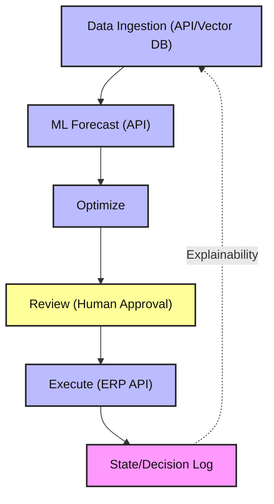

# Supply Chain Reorder Agent

An agentic AI system to help supply chain planners decide how much inventory to reorder. Built with LangGraph for workflow orchestration, modular nodes, and explainable state management.

## Features
- LangGraph workflow for modular, extensible agent logic
- Nodes for data ingestion (API/vector DB), ML forecasting (API), optimization, human review, and execution
- State management for explainability and traceability
- Ready for integration with ERP APIs, ML models, and data sources
- Configurable business rules
- Unit tests and production-ready structure

## Workflow Overview

The agent is orchestrated by LangGraph. Each step is a node in the workflow:

1. **Data Ingestion**: Fetches sales and inventory data from an API or vector database (stubbed, ready for integration)
2. **ML Forecasting**: Calls an external ML model API for demand forecasting (stubbed, ready for integration)
3. **Optimization**: Calculates reorder quantity using EOQ and safety stock logic
4. **Review**: Flags large orders for human review
5. **Execution**: Simulates ERP API call for order execution

All calculations and decisions are logged for explainability. You can extend any node to connect to real APIs, databases, or ML endpoints as needed.

## Setup
1. Clone the repo
2. Install dependencies: `pip install -r requirements.txt`
3. Configure settings in `config/`
4. Run the agent: `python src/main.py`

## Project Structure
- `src/` – Agent logic, LangGraph workflow, state management
- `tests/` – Unit tests
- `config/` – Configuration files
- `.github/` – Copilot instructions

## Architecture Diagram



## Extending the Agent

- **Data Ingestion**: Integrate with your API or vector DB by editing `ingest_data` in `src/agent_langgraph.py`.
- **ML Forecasting**: Integrate with your ML model API by editing `ml_forecast` in `src/agent_langgraph.py`.
- **Optimization, Review, Execution**: Update business logic or connect to real systems as needed.

## Example Node (ML Forecast)

```python
def ml_forecast(state: AgentState, **kwargs):
	# Example: Call an external ML model API for forecasting
	response = requests.post("https://ml.example.com/forecast", json={
		"sales_history": state.data["sales_history"],
		"lead_time": state.data["lead_time"]
	})
	forecast = response.json()["forecast"]
	state.data["forecast"] = forecast
	state.log(f"ML forecast for next {state.data['lead_time']} days: {forecast}")
	return state
```

---
	class SupplyChainReorderAgent {
		-AgentState state
		-list nodes
		+run()
	}
	class AgentState {
		-dict data
		-list decision_log
		+log(message)
		+explain()
	}
	class gather_data_node {
		+__call__(state)
	}
	class forecast_node {
		+__call__(state)
	}
	class optimize_node {
		+__call__(state)
	}
	class review_node {
		+__call__(state)
	}
	class execute_node {
		+__call__(state)
	}
	SupplyChainReorderAgent --> AgentState
	SupplyChainReorderAgent --> gather_data_node
	SupplyChainReorderAgent --> forecast_node
	SupplyChainReorderAgent --> optimize_node
	SupplyChainReorderAgent --> review_node
	SupplyChainReorderAgent --> execute_node
	AgentState <.. gather_data_node : uses
	AgentState <.. forecast_node : uses
	AgentState <.. optimize_node : uses
	AgentState <.. review_node : uses
	AgentState <.. execute_node : uses
```

## Usage
Edit `config/` for your environment and run the agent. See `src/main.py` for the entry point and flow.

## License
MIT
