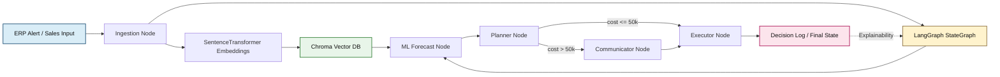
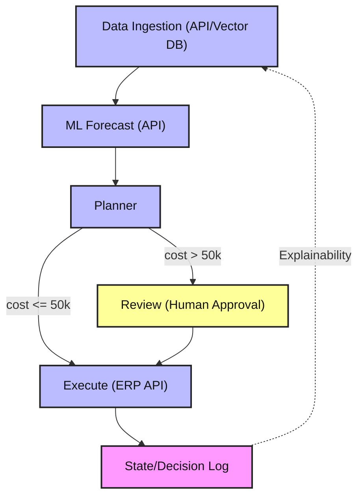

# Supply Chain Reorder Agent

An agentic AI system to help supply chain planners decide how much inventory to reorder. Built with LangGraph for workflow orchestration, modular nodes, and explainable state management.

## Features
- LangGraph workflow for modular, extensible agent logic
- Nodes for data ingestion (API/vector DB), ML forecasting (API), optimization, human review, and execution
- State management for explainability and traceability
- Ready for integration with ERP APIs, ML models, and data sources
- Configurable business rules
- Unit tests and production-ready structure

## Workflow Overview

The agent is orchestrated by LangGraph. The logical flow is:

1. **Data Ingestion**: Parses disruption input and stores embedded chunks in Chroma
2. **ML Forecasting**: Retrieves vector context and optionally forecasts demand from `sales_history`
3. **Planner**: Chooses a mitigation path and records disruption cost
4. **Review**: Flags expensive disruptions for human approval
5. **Execution**: Finalizes mitigation execution and logs the outcome

All calculations and decisions are logged for explainability. You can extend any node to connect to real APIs, databases, or ML endpoints as needed.

## Setup
1. Clone the repo
2. Install dependencies: `pip install -r requirements.txt`
3. Configure settings in `config/`
4. Run the agent: `python src/main.py`

## Project Structure
- `src/` – Agent logic, LangGraph workflow, state management
- `tests/` – Unit tests
- `config/` – Configuration files
- `.github/` – Copilot instructions

## Infrastructure Diagram

This diagram shows the runtime components: the input, embedding layer, vector store, graph execution, and final decision log.



## State Diagram

This diagram shows the logical decision path inside the LangGraph workflow.



## Extending the Multi-Agent Workflow

The code in `src/multi_agent_supply_chain.py` is organized around these nodes:

- `agent_ingestion`: parses disruption input and stores embedded chunks in Chroma
- `ml_forecast_agent`: retrieves vector context and produces a forecast when sales history is available
- `agent_planner`: chooses the mitigation path and computes disruption cost
- `agent_communicator`: flags approvals for human review when the disruption is expensive
- `agent_executor`: finalizes mitigation execution

## Example Forecast Path

If you want to exercise the forecast branch, seed the agent with `sales_history` and `lead_time` before calling `run()`:

```python
from src.multi_agent_supply_chain import MultiAgentSupplyChain

agent = MultiAgentSupplyChain()
agent.state = {
	"sales_history": [120, 132, 128, 140, 138],
	"lead_time": 2,
	"decision_log": []
}
agent.run()

print(agent.state.get("forecast"))
print(agent.state.get("decision_log"))
```

If TensorFlow is installed, the forecast node will try an LSTM-based prediction. Otherwise, it falls back to the mean of the most recent `lead_time` sales values.

## Usage
Edit `config/` for your environment and run the agent. See `src/main.py` for the entry point and flow.

## License
MIT
