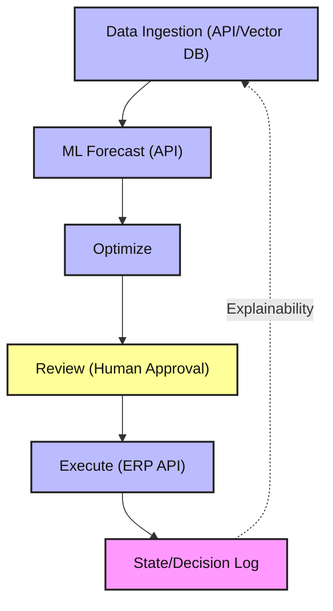

# Supply Chain Reorder Agent

An agentic AI system to help supply chain planners decide how much inventory to reorder. Built with LangGraph for workflow orchestration, modular nodes, and explainable state management.

## Features
- LangGraph workflow for modular, extensible agent logic
- Nodes for data ingestion (API/vector DB), ML forecasting (API), optimization, human review, and execution
- State management for explainability and traceability
- Ready for integration with ERP APIs, ML models, and data sources
- Configurable business rules
- Unit tests and production-ready structure

## Workflow Overview

The agent is orchestrated by LangGraph. Each step is a node in the workflow:

1. **Data Ingestion**: Fetches sales and inventory data from an API or vector database (stubbed, ready for integration)
2. **ML Forecasting**: Calls an external ML model API for demand forecasting (stubbed, ready for integration)
3. **Optimization**: Calculates reorder quantity using EOQ and safety stock logic
4. **Review**: Flags large orders for human review
5. **Execution**: Simulates ERP API call for order execution

All calculations and decisions are logged for explainability. You can extend any node to connect to real APIs, databases, or ML endpoints as needed.

## Setup
1. Clone the repo
2. Install dependencies: `pip install -r requirements.txt`
3. Configure settings in `config/`
4. Run the agent: `python src/main.py`

## Project Structure
- `src/` – Agent logic, LangGraph workflow, state management
- `tests/` – Unit tests
- `config/` – Configuration files
- `.github/` – Copilot instructions

## Architecture Diagram



## Extending the Multi-Agent Workflow

- **Data Ingestion**: Integrate with your API or vector DB by editing the `ingestion_agent` node in `src/multi_agent_supply_chain.py`.
- **Simulation/Forecasting**: Integrate with your ML model API by editing the `simulation_agent` node in `src/multi_agent_supply_chain.py`.
- **Planning/Optimization, Review, Execution**: Update business logic or connect to real systems by editing the corresponding agent nodes in `src/multi_agent_supply_chain.py`.

## Example Node (Simulation Agent)

```python
def simulation_agent(state: dict, **kwargs):
	# Example: Call an external ML model API for forecasting
	response = requests.post("https://ml.example.com/forecast", json={
		"sales_history": state["sales_history"],
		"lead_time": state["lead_time"]
	})
	forecast = response.json()["forecast"]
	state["forecast"] = forecast
	# Optionally log or update state as needed
	return state
```

---
	## Multi-Agent Architecture Overview

	The new workflow is implemented in `src/multi_agent_supply_chain.py` using LangGraph's StateGraph. Each agent is a node in the workflow:

	- **ingestion_agent**: Handles data ingestion from APIs or vector DBs
	- **simulation_agent**: Performs forecasting or simulation
	- **planning_agent**: Optimizes reorder decisions
	- **communication_agent**: Handles human review/approval
	- **execution_agent**: Executes orders via ERP/API

	You can extend or customize each agent node as needed. See the code scaffold in `src/multi_agent_supply_chain.py` for details.
	// The old node-based class diagram has been removed. See the section above for the new multi-agent architecture and agent node descriptions.

	### Using Neural Networks for Forecasting

	You can implement the simulation/forecast agent using a neural network (e.g., LSTM or RNN) with TensorFlow/Keras or PyTorch for advanced time series forecasting. This approach is suitable for complex, non-linear patterns and large datasets. See the code for the simulation_agent in `src/multi_agent_supply_chain.py` for where to integrate your model.
```

## Usage
Edit `config/` for your environment and run the agent. See `src/main.py` for the entry point and flow.

## License
MIT
