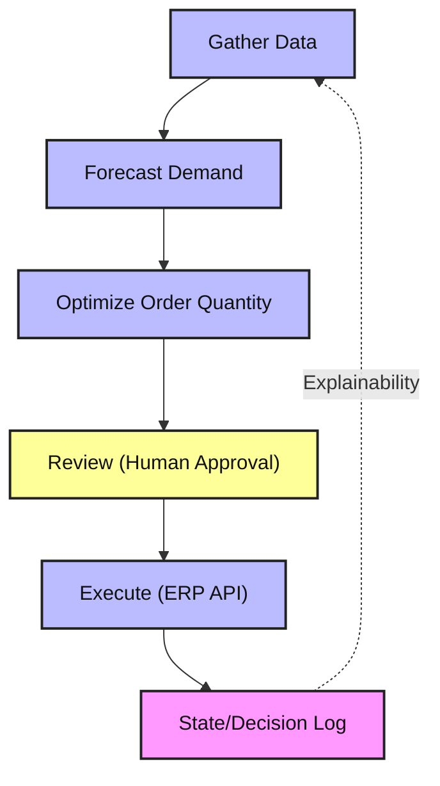
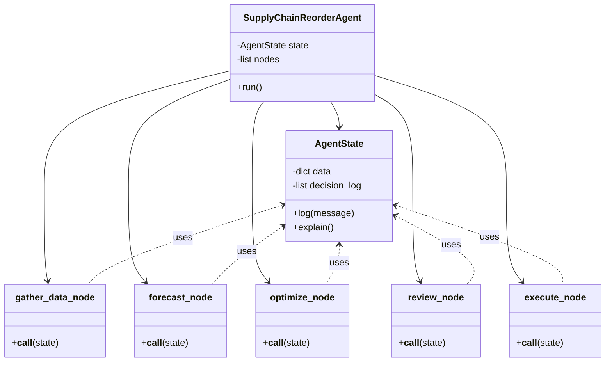

# Supply Chain Reorder Agent

A production-grade, agentic AI system to help supply chain planners decide how much inventory to reorder. Built with LangGraph, modular nodes, and explainable state management.

## Features
- Modular agent with nodes for data gathering, forecasting, optimization, human review, and execution
- State management for explainability and traceability
- Stubs for integration with ERP APIs, ML models, and data sources
- Configurable business rules
- Unit tests and production-ready structure

## Setup
1. Clone the repo
2. Install dependencies: `pip install -r requirements.txt`
3. Configure settings in `config/`
4. Run the agent: `python src/main.py`

## Project Structure
- `src/` – Agent logic, nodes, state management
- `tests/` – Unit tests
- `config/` – Configuration files
- `.github/` – Copilot instructions

## Architecture Diagrams

### Agentic Flow

### Python Class Architecture

## Usage
Edit `config/` for your environment and run the agent. See `src/main.py` for the entry point and flow.

## License
MIT
